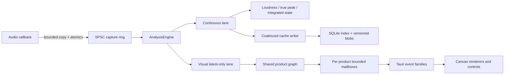

# Real-time metering engine

**Status:** normative technical design  
**Scope:** PulseSeek live analysis, configurable Meters workspace, future offline consumers

## Design goals

The engine maximizes customization without multiplying DSP work. A user may
change tile layout, analysis profile, FFT resolution, window, channel view,
bands, smoothing, colors, overlays, update rate, and history policy. Settings
are data, not hard-coded widget branches.

Performance is protected by one shared product graph:

- the audio callback only publishes bounded captured blocks and atomics;
- Rust workers own buffering, FFT, filters, aggregation, and persistence;
- visual consumers receive latest-only snapshots;
- continuous measurements receive a loss-intolerant lane;
- products start with their first compatible subscriber and stop after the last;
- no tile owns a worker, playback clock, FFT plan, or database connection.

## Source points and session continuity

The source adapter emits a versioned AnalysisBlock:

```text
AnalysisBlock {
  session_id
  source_id
  point: Source | Monitor | External(app-id)
  sample_rate
  channels: Mono | Stereo
  first_sample
  frame_count
  interleaved_samples
  discontinuity: None | Seek | LoopWrap | FormatChange | Gap | Stop
}
```

Source is after decode and before resampling/gain/output. Monitor is after
resampling and before user volume. External adapters must name the captured
application or device and must not claim DAW bus/track precision.

A normal seek, file change, format change, channel change, or source change
starts a new session. A/B loop wrap remains in the same session. Pause freezes
measurement clocks; renderers may decay their presentation toward silence.

## Worker topology



The capture ring is bounded. Saturation increments a counter and drops the
incoming visual block. If a continuous product would lose samples, the
affected result becomes Measurement incomplete; the engine never silently
continues with a false integrated value.

The visual lane may drop old frames and keep the newest one. Render cadence is
independent from DSP cadence. React owns tile structure and controls; Canvas 2D
owns high-frequency drawing. A future WebGL renderer implements the same
renderer contract and requires an ADR plus benchmark evidence.

## Product graph

Products are keyed by a normalized request:

```text
ProductKey {
  source_point
  channel_view
  fft_size
  window
  hop
  product_kind
  algorithm_version
}
```

Compatible requests share upstream products. Typical graph:

```text
FFT(channel L/R, N, window)
  ├─ Spectrum(mode, smoothing, tilt)
  ├─ BandEnergy(profile, method, channel mode)
  ├─ Spectrogram(palette, range)
  ├─ ColoredWaveform(color mode, temporal resolution)
  └─ StereoByFrequency(M/S/correlation)

TimeDomain(L/R)
  ├─ Peak/RMS
  ├─ Balance and broadband correlation
  └─ ColoredWaveform energy envelope

KWeighting(L/R)
  └─ LUFS-M/S/I and LRA

Oversampled(L/R)
  └─ TruePeak
```

Display-only transforms such as tilt, palette, axis scaling, decay rendering, and
pixel interpolation never create a new DSP product.

## Customization model

All settings are versioned and validated. A tile stores a stable tile_id,
module_kind, profile_id, product_request, renderer settings, and visibility
state.

An AnalysisProfile contains:

- quality target: Eco, Normal, High, or Expert;
- FFT sizes and windows per product;
- target render FPS from 1 to 120 for Expert, clamped by adaptive protection;
- smoothing attack/release, averaging, peak hold, and decay;
- channel view and measurement point;
- band profile and calculation method;
- display floor, range, tilt, palette, and color mapping;
- history duration and cache policy.

A profile may be exported/imported as versioned JSON. Invalid fields fall back
individually to documented defaults, preserving unrelated user settings.

Defaults:

| Profile | Render target | Visual FFT refresh | Default overlap | Intended use |
|---|---:|---:|---:|---|
| Eco | 15 FPS | 15 FPS | 25% | many tiles or portable machines |
| Normal | 30 FPS | 30 FPS | 50% | default |
| High | 60 FPS | 60 FPS | 75% | focused inspection |
| Expert | user 1–120 FPS | user | user | explicit CPU trade-off |

Continuous loudness and true peak do not follow render FPS.

## Adaptive performance policy

The engine reports CPU time, p95/p99 analysis time, queue depth, visual drops,
memory, and audio underruns. Degradation is ordered:

1. stop products with no subscribers;
2. reduce visual FPS 60 → 30 → 15;
3. increase visual hop;
4. remove optional large FFT branches;
5. drop stale visual snapshots;
6. disable lowest-priority experimental overlays;
7. mark continuous measurements incomplete if samples were lost;
8. never block or slow the audio callback.

Recovery uses hysteresis. The user sees the active quality and the reason for
degradation. A manual Expert override never disables callback safety.

## Decision-support overlays

These are optional, configurable visual products, not automatic mix advice:

- **Spectral occupancy field:** each band displays instantaneous energy,
  rolling percentile, and user-selected baseline window. It can show density and
  change without labeling a band as wrong.
- **Coexistence/masking matrix:** two user-selected snapshots, tracks, or future
  reference sources are compared by band and time. It reports overlap values,
  not a masking verdict.
- **Mono survivability field:** per-frequency correlation and Mid/Side energy
  show what remains under mono fold-down, including the L=-R cancellation case.
- **Transient/tonal contrast:** compares short-window energy to local sustain
  energy and displays the ratio over time.
- **Dynamic density map:** combines crest factor, RMS distribution, peak hold, and
  spectral occupancy in a zoomable time/band field.
- **Uncertainty/coverage layer:** distinguishes measured, stale, interpolated,
  incomplete, and unplayed regions.
- **Decision snapshots:** freeze a synchronized set of tile states, cursor time,
  settings, and user annotations for later comparison.
- **Cost inspector:** shows product sharing, CPU time, memory, queue depth, and
  what would stop if a tile were removed.

Experimental overlays are opt-in, carry an algorithm version, and can be hidden
without stopping the core meter products. No overlay emits prose such as
compress this or fix that.

## External monitoring

External monitoring is an adapter, not a second engine. The first platform
adapter is macOS application output capture. Permission, selected application,
capture state, format changes, and Stop are visible. Future system mix, loopback,
audio input, and DAW bus/track adapters implement the same source contract.

## Documentation invariant

Every implementation PR updates the relevant algorithm, event, cache, lifecycle,
performance, calibration, and user-control documentation. The code is not
considered complete when its units, ownership, queue capacity, or validity rules
cannot be explained from versioned documents.
