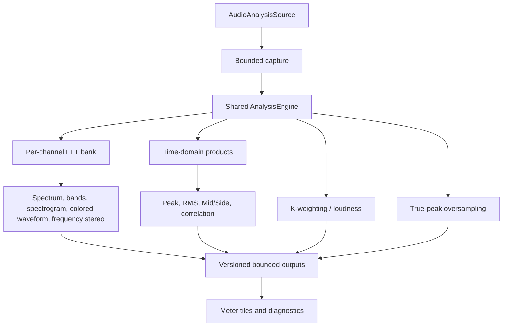

# PulseSeek Functional Specification

## 1. Purpose

PulseSeek is an open-source, cross-platform desktop application for browsing,
previewing, sorting, cataloguing, analyzing, and organizing local audio.

The product is composed of four clearly separated user-facing modules:

1. **Audio Player** — fast folder-based auditioning and file triage.
2. **Sample Manager** — a persistent sample library.
3. **Music Manager** — a persistent music library.
4. **Playlist Manager** — playlists containing samples or music, with DJ
   synchronization and export.

These modules belong to one application and share reusable services, but their
domain models and persistent data must remain separate.

### 1.1 Specification hierarchy and implementation contract

This file remains the product-level functional specification for PulseSeek. It
defines the product priorities, module boundaries, cross-module requirements,
and global non-functional constraints. Its real-time visualization requirements
(`FR-VS-*`) and section 4.5 are not discarded by the more detailed metering
specifications; they are the product-level contract that the metering work must
continue to satisfy.

The metering specifications are subordinate, complementary specifications:

- `spec/metering-functional-specification.md` refines the user-visible behavior
  of the Meters workspace and each analysis tile;
- `spec/metering-dsp-specification.md` defines formulas, numerical conventions,
  windows, FFT products, units, and algorithm versions;
- `spec/metering-architecture-specification.md` defines Rust/React ownership,
  source ports, workers, queues, subscriptions, IPC, and cache contracts;
- `spec/metering-validation-specification.md` defines fixtures, tolerances,
  lifecycle scenarios, performance budgets, and release evidence.

The implementation plan is the execution authority: it maps each requirement
to a small PR, its dependencies, failing tests, acceptance evidence, and the
specifications that must be read and updated. A PR is not complete because a
document was written; its behavior, tests, and traceability evidence must also
be complete. If a detailed metering rule conflicts with a product boundary in
this file, the product boundary wins and the detailed specification must be
amended before implementation continues.

## 2. Product priorities

### 2.1 Top priority

The first usable product is the Audio Player. It must:

- Open any accessible folder.
- Display its folder tree.
- Hide files that PulseSeek cannot decode.
- Play a supported file with one click.
- Delete unwanted files safely.
- Play a file once or loop it.
- Display a seekable waveform.
- Provide additional audio visualizations.
- Remain usable without any library database.

### 2.2 Product principles

PulseSeek shall be:

- Modular and extensible.
- Fast and lightweight.
- Local-first and fully usable offline.
- Independent of mandatory accounts and cloud services.
- Available on macOS, Windows, and Linux.
- Suitable for local disks, external drives, and mounted network storage.
- Safe when modifying user files.
- Responsive with large folders and libraries.
- Accessible by mouse and keyboard.

## 3. Module boundaries

### 3.1 Audio Player

The Audio Player is a folder browser and preview tool. It reads the filesystem
directly and does not require a library.

Opening or playing a folder shall not:

- Import files into a manager.
- Create persistent library items.
- Copy or move files.
- Modify embedded metadata.
- Start mandatory heavy analysis.

The Audio Player may explicitly send selected files to the Sample Manager,
Music Manager, or Playlist Manager.

### 3.2 Sample Manager

The Sample Manager is a persistent sample catalogue backed by its own SQLite
database. It manages sample-specific metadata, tags, analysis, search, and
organization.

### 3.3 Music Manager

The Music Manager is a persistent music catalogue backed by its own SQLite
database. It manages track-specific metadata, tags, analysis, search, and
organization.

### 3.4 Playlist Manager

The Playlist Manager is backed by its own SQLite database. It stores ordered
references to Sample Manager and Music Manager items without duplicating their
complete metadata.

### 3.5 Shared services

The modules may share:

- Audio decoding and playback.
- Audio-device management.
- Filesystem access.
- Metadata reading.
- Waveform generation.
- Audio analysis.
- Search primitives.
- Plugin discovery and hosting.
- Application preferences and technical caches.

Shared services must not merge the three manager databases into one domain
database.

## 4. Functional requirements

Priorities:

- **P0** — first playable vertical slice.
- **P1** — complete Audio Player.
- **P2** — first persistent managers.
- **P3** — integrations and extensibility.
- **Later** — explicitly deferred.

### 4.1 Folder browser

- **FR-BR-001 (P0):** The user shall be able to open an arbitrary folder with a
  system folder picker.
- **FR-BR-002 (P0):** The application shall display the current folder and its
  directory tree.
- **FR-BR-003 (P0):** The browser shall show only files supported by the active
  decoder registry.
- **FR-BR-004 (P0):** Unsupported files shall be hidden by default.
- **FR-BR-005 (P1):** The user may reveal unsupported files through a setting.
- **FR-BR-006 (P0):** The user shall be able to navigate into a subfolder and
  return to its parent.
- **FR-BR-007 (P1):** The user shall be able to refresh the current folder.
- **FR-BR-008 (P1):** The browser shall detect relevant filesystem changes and
  refresh without losing the current selection when possible.
- **FR-BR-009 (P1):** The user shall be able to open a folder by drag and drop.
- **FR-BR-010 (P1):** The application shall accept a folder or file path at
  startup.
- **FR-BR-011 (P1):** The user shall be able to reopen recent folders.
- **FR-BR-012 (P1):** The user shall be able to enable a recursive file view.
- **FR-BR-013 (P0):** Local folders, external disks, and mounted network volumes
  exposed by the operating system shall be supported.
- **FR-BR-014 (P0):** Folder browsing shall work when all manager databases are
  absent or unavailable.

### 4.2 File list and fast triage

- **FR-LS-001 (P0):** The list shall display file name and extension.
- **FR-LS-002 (P1):** The list shall display available duration, size,
  modification date, channels, sample rate, bit depth, and codec.
- **FR-LS-003 (P1):** The user shall be able to sort by name, duration, size,
  type, modification date, and path.
- **FR-LS-004 (P1):** The user shall be able to filter by format and search the
  current folder.
- **FR-LS-005 (P1):** Multiple file selection shall be supported.
- **FR-LS-006 (P1):** The user shall be able to mark files temporarily as
  `Keep`, `Maybe`, `Reject`, or `Favorite`.
- **FR-LS-007 (P1):** Session marks shall not create library items.
- **FR-LS-008 (P1):** The user shall be able to filter and batch-select files by
  session mark.

### 4.3 Playback

- **FR-AU-001 (P0):** One left click on a supported file shall select and start
  playback.
- **FR-AU-002 (P0):** Selection-to-playback latency shall be minimized for rapid
  auditioning.
- **FR-AU-003 (P0):** The user shall be able to play, pause, stop, seek, and
  return to the beginning.
- **FR-AU-004 (P0):** The user shall be able to control output volume.
- **FR-AU-005 (P0):** The user shall be able to select the previous or next
  supported file.
- **FR-AU-006 (P0):** `One shot` mode shall stop at the end of the current file.
- **FR-AU-007 (P0):** `Loop` mode shall repeat the current file seamlessly.
- **FR-AU-008 (P1):** Sequential and random playback modes shall be available.
- **FR-AU-009 (P1):** A–B repeat shall allow a selected region to loop.
- **FR-AU-010 (P1):** Extremely short files, including single-cycle waveforms,
  shall loop without an audible gap when the audio backend permits it.
- **FR-AU-011 (P1):** The user may continue at the same relative or absolute
  playback position when switching files for mix comparison.
- **FR-AU-012 (P1):** Optional smooth fade-out shall be available when stopping
  or changing files.
- **FR-AU-013 (P0):** Corrupt, missing, or inaccessible files shall produce a
  recoverable error and shall not stop browsing other files.
- **FR-AU-014 (P0):** Every user-selectable Audio Player preference shall be
  persisted immediately after the interaction and restored on the next launch.
- **FR-AU-015 (P0):** Restored player preferences shall include playback mode,
  output device when still available, volume, mute, resizable panel dimensions,
  selected browser folder, expanded folders, and the last played file.
- **FR-AU-016 (P0):** Restoring the last played file shall reveal and select it
  in the browser without starting playback.
- **FR-AU-017 (P0):** Playback state shall remain ephemeral, while the last
  confirmed position shall be persisted. PulseSeek shall start stopped with
  the last file selected and its playhead restored, then resume from that
  position only when the user starts playback.
- **FR-AU-018 (P0):** Missing files, folders, volumes, or output devices in
  saved preferences shall fall back safely without blocking startup.

### 4.4 Waveform and visualizations

- **FR-VS-001 (P0):** The selected file shall have a waveform generated on
  demand.
- **FR-VS-002 (P0):** The waveform shall display playback progress.
- **FR-VS-003 (P0):** Clicking or dragging on the waveform shall seek playback.
- **FR-VS-004 (P1):** Waveform rendering shall support at least solid, gradient,
  and outline styles.
- **FR-VS-005 (P1):** The application shall provide a real-time logarithmic
  frequency analyzer.
- **FR-VS-006 (P1):** The application shall provide a real-time linear frequency
  analyzer.
- **FR-VS-007 (P1):** The application shall provide a musical spectrum whose
  frequency bands map to musical pitches.
- **FR-VS-008 (P3):** Additional visualizers may be installed as plugins.
- **FR-VS-009 (P1):** Visualization processing shall not interrupt playback.
- **FR-VS-010 (P1):** Cached waveform data shall remain technical cache data and
  shall not create a manager item.

Candidate later visualizations include a spectrogram, vectorscope/goniometer,
phase correlation meter, oscilloscope, loudness history, and stereo spectrum.

### 4.5 Real-time metering and mixing/mastering analysis

The Audio Player shall provide a live metering workspace for interpreting a mix
or master. It displays measurements and relationships; it does not issue an
automatic artistic verdict.

The first live module family includes Spectrum Analyzer, configurable band
energy, colored waveform, spectrogram, loudness, sample peak, true peak,
stereo, Mid/Side, correlation, and phase-cancellation visibility. Whole-file
offline analysis and reference comparison remain future consumers of the same
analysis products.

#### Lower workspace and configurable tiles

The lower player area shall switch between two preserved workspaces:

- **Browser:** the existing folder tree and File List.
- **Meters:** a configurable grid of analysis tiles.

The upper waveform, seek, and transport remain available. Switching workspaces
preserves Browser selection, scroll, expanded folders, tile layout, tile
settings, subscriptions, and relevant live state. Meters supports adding,
removing, duplicating, reordering, resizing, maximizing, and restoring named
layouts. Tiles and controls shall be keyboard accessible and shall expose their
units, source, measurement point, quality, and error/degraded state.

#### Shared real-time analysis pipeline



The Source point is after decoding and before resampling, gain, and output. The
Monitor point is after resampling and before user volume, preserving L/R.
Mono and stereo are the initial supported topologies.

The audio callback may only publish bounded captured blocks and atomics. It
shall not allocate, lock, log, perform I/O, SQL, FFT, or communicate with
React. Rust owns the shared engine, windows, buffers, workers, subscriptions,
and output delivery. Products start with their first compatible consumer and
stop after the last one. Visual outputs are latest-only; loudness and true peak
use a continuous lane that cannot silently lose samples.

#### Live metering requirements

- **FR-MW-001..006:** The lower area switches Browser/Meters; state is preserved;
  Meters supports multiple configurable accessible tiles and named layouts.
- **FR-MS-001..008:** Source/Monitor points, session metadata, mono/stereo,
  pause decay, ordinary-seek reset, A/B-loop continuity, source changes, and
  explicit global/per-tile reset are defined.
- **FR-SP-001..010:** Shared per-channel FFT supports 2,048/4,096/8,192/16,384
  points; selectable windows; L/R, energy, mono, Mid, Side and difference modes;
  instant/smoothing/averages/peak-hold; dBFS/PSD; linear/log axes; visual tilt.
- **FR-BE-001..007:** Default musical bands cover infrabass through air; bands
  are editable/addable/removable; overlaps/gaps are visible; bin power, filtered
  RMS, PSD and relative energy are selectable; overlay and standalone views exist.
- **FR-CW-001..006:** Colored waveform represents only played/captured coverage,
  supports spectral/energy color modes, remains readable without color, and is
  multiresolution with distinct unknown/invalid segments.
- **FR-SG-001..004:** Spectrogram rows reuse shared FFT data and expose bounded
  scrolling, frequency range, dynamic range, palette, and speed.
- **FR-LD-001..007:** LUFS-M/S/I, gating, duration, LRA, sample peak, true peak,
  calibration, incomplete-measurement state, compact view, and live history
  follow ITU-R BS.1770 / EBU R128.
- **FR-ST-001..006:** Balance, M/S, width, broadband and frequency correlation,
  goniometer modes, mono-compatible monitoring, and visible L=-R cancellation
  are provided.
- **FR-CF-001..004:** Eco/Normal/High target 15/30/60 FPS; hop and overlap
  depend on preset/product/rate; overrides and serialized settings migrate.
- **FR-DG-001:** Diagnostics shall expose source, measurement point, sample
  rate, channel count, active profile, effective FPS, and latency.
- **FR-DG-002:** Diagnostics shall expose queue depth, drops, active products,
  FFT sharing, and the current degradation level.
- **FR-DG-003:** Diagnostics shall expose incomplete, unavailable, invalid,
  and permission/source failure states without blocking playback.
- **FR-EX-001..006:** External sources use the same contract with explicit
  selection, permission, visible capture, safe stop, and future system/DAW
  adapters kept separate.
- **FR-DS-001 (P1):** A configurable spectral-occupancy field shall show
  instantaneous energy, rolling percentiles, and a user-selected baseline
  without emitting an automatic mix verdict.
- **FR-DS-002 (P1):** A mono-survivability field shall show per-frequency
  correlation, Mid/Side energy, and fold-down behavior.
- **FR-DS-003 (P1):** A transient/tonal contrast view shall compare short-window
  energy with local sustain energy using an explicit configurable ratio.
- **FR-DS-004 (P1):** A dynamic-density map shall combine crest factor, RMS
  distribution, peak hold, and spectral occupancy over time and bands.
- **FR-DS-005 (P1):** Decision snapshots shall freeze synchronized tile states,
  settings, cursor time, and user annotations for later inspection.
- **FR-DS-006 (P1):** An uncertainty/coverage layer shall distinguish measured,
  stale, interpolated, incomplete, and unplayed regions.
- **FR-DS-007 (P1):** A cost inspector shall show shared products, CPU time,
  memory, queue depth, visual drops, and the products stopped by tile removal.

Pause freezes the measurement clock while presentation decays. Ordinary seek
resets continuity-dependent products; A/B loop wrap does not. Only played or
captured coverage is persisted. Large data uses versioned blobs referenced by
SQLite with source fingerprint, algorithm version, configuration, coverage,
checksum, and asynchronous atomic writes. Unknown regions are not silence.
Playback never waits for cache writes and the cache never creates a manager item.

The algorithm formulas, units, window normalization, thread ownership, event
schemas, backpressure, reset rules, cache migrations, calibration fixtures,
performance budgets, diagnostics, and user-visible controls shall be documented
in the same PR that introduces or changes them.

The normative technical references are:

- `spec/metering-functional-specification.md`;
- `spec/metering-dsp-specification.md`;
- `spec/metering-architecture-specification.md`;
- `spec/metering-validation-specification.md`;
- `docs/architecture/realtime-metering-engine.md`;
- `docs/dsp/metering-dsp-algorithms.md`;
- `docs/architecture/metering-event-and-cache-contracts.md`;
- `docs/testing/metering-calibration-and-performance.md`.

### 4.6 File operations

- **FR-FM-001 (P0):** The user shall be able to move selected files to the
  operating system trash.
- **FR-FM-002 (P0):** Permanent deletion shall never be the default.
- **FR-FM-003 (P0):** Destructive actions shall clearly identify their target
  and request confirmation when accidental loss is reasonably possible.
- **FR-FM-004 (P1):** The user shall be able to rename, move, and copy files.
- **FR-FM-005 (P1):** File operations shall support multiple selections.
- **FR-FM-006 (P1):** The user shall be able to reveal a file in the operating
  system file manager.
- **FR-FM-007 (P1):** The user shall be able to open a file in another
  application.
- **FR-FM-008 (P1):** The user shall be able to copy a file name or full path.
- **FR-FM-009 (P1):** The playing file shall be released or shared in a way that
  allows safe external editing or deletion when the operating system permits it.
- **FR-FM-010 (P1):** External file changes shall trigger metadata and waveform
  invalidation.
- **FR-FM-011 (P1):** The playing or selected file shall be draggable into
  compatible applications, including DAWs and audio editors.

### 4.7 Keyboard interaction

- **FR-KB-001 (P0):** The complete primary audition workflow shall be keyboard
  accessible.
- **FR-KB-002 (P0):** Default commands shall include play/pause, play selection,
  previous, next, seek backward, seek forward, loop toggle, move to trash, and
  open folder.
- **FR-KB-003 (P1):** Refresh, search, A–B repeat, playback-mode selection, and
  session marks shall have shortcuts.
- **FR-KB-004 (P1):** Shortcuts shall be configurable.
- **FR-KB-005 (P1):** Mouse-wheel interaction may adjust hovered controls, such
  as volume or scrollable lists, without requiring a preliminary click.

### 4.8 Audio output

- **FR-IO-001 (P0):** PulseSeek shall enumerate available audio output devices.
- **FR-IO-002 (P0):** The user shall be able to select an output device.
- **FR-IO-003 (P0):** The application shall use a sensible system-default output
  when no explicit device is configured.
- **FR-IO-004 (P1):** Device loss or disconnection shall pause safely and offer
  another available device.
- **FR-IO-005 (P1):** When supported, the user may select sample rate, buffer
  size, and exclusive/shared mode.
- **FR-IO-006 (P1):** Audio shall be processed internally with a floating-point
  signal path.
- **FR-IO-007 (P0):** Selecting another available output device during playback
  shall preserve the current file, playback position, volume, playback mode,
  and playing or paused state; the user shall not need to restart playback.

### 4.9 Sample Manager

- **FR-SM-001 (P2):** The Sample Manager shall use its own versioned SQLite
  database.
- **FR-SM-002 (P2):** Files shall enter the Sample Manager only through an
  explicit user action.
- **FR-SM-003 (P2):** The Audio Player shall send selected files to the Sample
  Manager by reference, copy, or move.
- **FR-SM-004 (P2):** Copy and move operations shall clearly describe their
  filesystem consequences.
- **FR-SM-005 (P2):** The manager shall play, sort, search, filter, tag, rate,
  favorite, annotate, and categorize samples.
- **FR-SM-006 (P2):** Sample metadata may include instrument, type, genre, BPM,
  key, duration, loop/one-shot classification, license, source, and color.
- **FR-SM-007 (P2):** Analysis may include waveform, BPM, key, loudness, peak,
  true peak, silence, transients, loop detection, energy, and similarity.
- **FR-SM-008 (P2):** Heavy analysis shall be asynchronous, cancellable, and
  optional.
- **FR-SM-009 (P2):** Sample Manager items shall be addable to the Playlist
  Manager without duplicating the audio file.
- **FR-SM-010 (P3):** A DAW plugin shall browse/search PulseSeek samples, preview
  them, and transfer or drag them into the DAW.
- **FR-SM-011 (P3):** The DAW bridge shall communicate with the desktop
  application through a versioned local protocol.

### 4.10 Music Manager

- **FR-MM-001 (P2):** The Music Manager shall use its own versioned SQLite
  database.
- **FR-MM-002 (P2):** Files shall enter the Music Manager only through an
  explicit user action.
- **FR-MM-003 (P2):** The Audio Player shall send selected files to the Music
  Manager by reference, copy, or move.
- **FR-MM-004 (P2):** The manager shall play, sort, search, filter, tag, rate,
  favorite, annotate, and categorize music tracks.
- **FR-MM-005 (P2):** Music metadata may include title, artist, album, genre,
  subgenre, BPM, key, duration, year, energy, comment, color, cue points, loops,
  source, and license.
- **FR-MM-006 (P2):** Music analysis may include waveform, BPM, key, loudness,
  peak, true peak, spectrum, silence, energy, and similarity.
- **FR-MM-007 (P2):** Music Manager items shall be addable to the Playlist
  Manager without duplicating the audio file.
- **FR-MM-008 (P2):** Missing referenced files shall be detectable and
  relinkable.

### 4.11 Playlist Manager

- **FR-PM-001 (P2):** The Playlist Manager shall use its own versioned SQLite
  database.
- **FR-PM-002 (P2):** A playlist shall contain ordered references to sample or
  music items.
- **FR-PM-003 (P2):** The user shall be able to create, rename, duplicate,
  delete, reorder, and annotate playlists.
- **FR-PM-004 (P2):** The user shall be able to add items from the Audio Player,
  Sample Manager, and Music Manager.
- **FR-PM-005 (P2):** Deleting a playlist shall not delete its referenced audio
  files or manager items.
- **FR-PM-006 (P2):** The user shall be able to export playlists to M3U, M3U8,
  CSV, and JSON.
- **FR-PM-007 (P3):** The manager shall synchronize playlists with supported DJ
  applications.
- **FR-PM-008 (P3):** Rekordbox integration should prefer documented XML
  import/export.
- **FR-PM-009 (P3):** Serato integration shall avoid writing undocumented
  internal formats and prefer safe, documented exchange mechanisms.
- **FR-PM-010 (P3):** Engine DJ and other integrations shall be implemented as
  adapters.
- **FR-PM-011 (Later):** Smart playlists may update automatically from metadata
  rules.

### 4.12 Audio effect and visualizer plugins

- **FR-PL-001 (P3):** The desktop application shall discover supported audio
  effect plugins from configured locations.
- **FR-PL-002 (P3):** Initial third-party effect hosting shall target VST3.
- **FR-PL-003 (Later):** Audio Unit and CLAP hosting may be added.
- **FR-PL-004 (P3):** Effects shall be inserted after decoding and before output.
- **FR-PL-005 (P3):** Plugins shall be bypassable individually and globally.
- **FR-PL-006 (P3):** A failing plugin shall not corrupt manager databases or
  user audio files.
- **FR-PL-007 (P3):** Plugin scanning shall be isolated from the main UI process
  where practical.
- **FR-PL-008 (P3):** PulseSeek visualizer plugins shall consume a stable,
  read-only stream of analysis frames.
- **FR-PL-009 (P3):** Third-party plugin state shall be stored outside audio
  files unless the user explicitly exports it.

## 5. Data and persistence

### 5.1 Databases

PulseSeek shall keep separate files:

```text
app-cache.sqlite       Technical cache and application state
samples.sqlite         Sample Manager
music.sqlite           Music Manager
playlists.sqlite       Playlist Manager
```

Each database shall:

- Have independent migrations and schema versions.
- Be backed up before destructive migration.
- Use transactions for multi-step writes.
- Remain recoverable if another manager database is unavailable.

Cross-manager references shall use stable application identifiers plus enough
source information to detect stale or missing targets. SQLite foreign keys
shall not cross database boundaries.

### 5.2 Technical cache

The technical cache may contain:

- Recent folders and navigation history.
- User preferences.
- File fingerprints and modification timestamps.
- Cached metadata.
- Waveform peaks.
- Temporary analysis results.

Audio Player preferences are written when the corresponding interaction is
confirmed, not deferred until application shutdown. They are application state,
remain independent from all manager databases, and must not contain playback
position or a playing, paused, or stopped transport state.

A technical-cache record is never a Sample Manager or Music Manager item.

## 6. Supported formats

Initial decoder targets:

- WAV and BWF.
- AIFF.
- FLAC.
- MP3.
- OGG Vorbis.
- Opus.
- AAC, ALAC, and M4A when the selected decoder and platform support them.

Additional formats may be added through the decoder registry. The browser must
filter from actual decoder capability, not from file extension alone.

MIDI playback and audio extraction from video containers are deferred.

## 7. Non-functional requirements

### 7.1 Modularity

- Domain modules shall communicate through explicit interfaces and commands.
- UI components shall depend on application services, not concrete database or
  audio-backend implementations.
- Audio decoding, output, visualization, analysis, and integrations shall use
  registries or adapter interfaces.
- Plugin APIs and local protocols shall be versioned.
- Modules shall be testable with in-memory or fake adapters.
- No manager shall be required to construct or run the Audio Player.

### 7.2 Performance

- Folder enumeration shall be incremental and cancellable.
- Metadata, waveform, and analysis work shall run outside the UI thread.
- Playback shall have priority over visualization and background analysis.
- Large lists shall use virtualization.
- Network-volume latency shall not freeze the application.
- Cache invalidation shall use path, file size, and modification time at
  minimum; stronger fingerprints may be used when needed.

### 7.3 Reliability and safety

- PulseSeek shall never silently modify source audio or embedded metadata.
- File operations shall report complete and partial failures.
- Missing files and disconnected volumes shall not crash the application.
- Audio-device and plugin failures shall be recoverable.
- Manager writes shall be transactional.
- Permanent deletion shall require an explicit, separate action.

### 7.4 Portability

- The reusable core shall be written primarily in Rust.
- Platform-specific code shall be isolated behind interfaces.
- Paths and visible text shall support Unicode.
- macOS is the first development platform; Windows and Linux remain product
  requirements.

### 7.5 Privacy

- Core features shall require no account.
- Local paths, metadata, listening history, and analysis shall stay local unless
  the user invokes an explicit integration.

### 7.6 Real-time metering constraints

- **NFR-MT-001:** The audio callback never allocates, locks, logs, performs I/O,
  SQL, FFT, rendering, or Tauri/React communication.
- **NFR-MT-002:** Every queue has bounded capacity, saturation policy, counters,
  backpressure, and explicit shutdown behavior.
- **NFR-MT-003:** Playback has priority; stale visual frames may be dropped, but
  continuous measurement loss is visible and invalidates affected results.
- **NFR-MT-004:** The DSP engine remains independent of Tauri, React, SQLite,
  and concrete audio/capture adapters.
- **NFR-MT-005:** Eco/Normal/High target 15/30/60 FPS with measured degradation
  before playback is affected.
- **NFR-MT-006:** Algorithms, schemas, settings, cache blobs, migrations,
  diagnostics, and calibration tolerances are documented as implementation evolves.
- **NFR-MT-007:** Expert customization shall be represented by versioned profiles
  and data-driven tile settings, not duplicated widget-specific DSP paths.
- **NFR-MT-008:** Experimental decision-support views shall expose their formula,
  baseline, window, algorithm version, and validity state.
- **NFR-MT-009:** Every normative DSP product shall have deterministic fixtures,
  published tolerances, and a reproducible validation command before it is
  considered release-ready.
- **NFR-MT-010:** Every performance-sensitive change shall record hardware,
  sample rate, profile, tile layout, CPU/memory percentiles, queue metrics,
  visual drops, continuous gaps, and audio underruns before and after the
  change.

## 8. Resonic-inspired scope

PulseSeek uses the official Resonic Player feature page as a product reference,
not as a requirement to reproduce its implementation or interface exactly:

<https://resonic.at/player>

Features adopted into PulseSeek requirements:

- Fast and lightweight folder-first playback.
- One-click navigation and auditioning.
- A large seekable waveform.
- Frequency analyzer and musical spectrum.
- Sequential, random, one-shot, and loop modes.
- A–B repeat and seamless short-file loops.
- Keyboard-first operation.
- Drag and drop into compatible applications.
- Direct use of existing folder structures without mandatory library import.
- Safe coexistence with external file editors.

Windows-specific taskbar integration, sleep/hibernation actions, MIDI synthesis,
and legacy format parity are not part of the initial PulseSeek scope.

## 9. Acceptance criteria for the first usable release

The first Audio Player release is usable when:

1. On macOS, the user can open an accessible folder and navigate its tree.
2. Only files confirmed as decodable are visible by default.
3. One click starts supported audio promptly.
4. Play, pause, stop, seek, volume, previous, and next controls work reliably.
5. One-shot and seamless loop modes behave correctly for short and long files.
6. A waveform is generated asynchronously, displays progress, and supports seek.
7. The user can select an audio output device and recover from device loss.
8. Moving a file to trash refreshes the list without deleting unrelated data.
9. Corrupt, missing, inaccessible, and disconnected files produce actionable
   errors without crashing the application.
10. No manager database is required or populated by browsing and playback.
11. Playback remains stable while the waveform and one real-time visualization
   are active.
12. The primary workflow is keyboard accessible.

## 10. Glossary

| Concept | Required term |
| --- | --- |
| Direct folder exploration and audition | Audio Player |
| Current filesystem directory | Current folder |
| Visible files not imported anywhere | Browsed files |
| Temporary computed data | Technical cache |
| Persistent sample catalogue | Sample Manager |
| Persistent music catalogue | Music Manager |
| Persistent ordered lists | Playlist Manager |
| Explicit transition into a manager | Import |
| Keep the existing physical path | Reference |
| Duplicate into managed storage | Copy into manager |
| Relocate into managed storage | Move into manager |
| Ordered references to samples or music | Playlist |

The words **Sample Manager** and **Music Manager** shall never describe files
merely visible in an opened folder.
